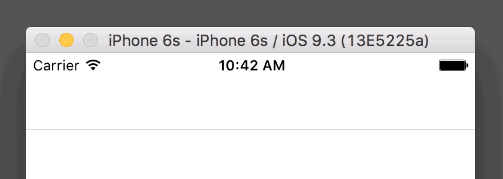
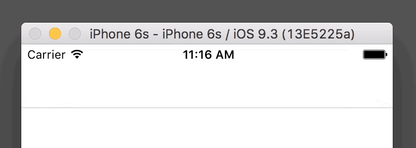
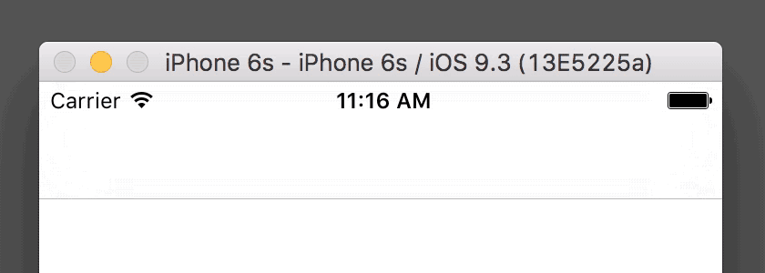

# LoadingBanner
[](https://github.com/benjaminsnorris/LoadingBanner/releases)
[](/LICENSE)
[](https://github.com/Carthage/Carthage)
[](https://swift.org/package-manager)

An iOS component for a small, collapsible banner to show loading or error status

1. [Requirements](#requirements)
2. [Usage](#usage)
  - [Shared Loading Banner](#shared-loading-banner)
  - [Available actions](#available-actions)
    - [showLoading()](#showloading)
    - [showMessage(String?)](#showmessagestring)
    - [showError(String?)](#showerrorstring)
    - [dismiss()](#dismiss)
  - [Customization](#customization)
    - [backgroundTint: UIColor](#backgroundtint-uicolor)
    - [errorTint: UIColor](#errortint-uicolor)
    - [height: CGFloat](#height-cgfloat)
    - [defaultText: String](#defaulttext-string)
3. [Integration](#integration)
  - [Carthage](#carthage)
  - [Swift Package Manager](#swift-package-manager)
  - [Git Submodules](#git-submodules)


## Requirements
- iOS 9.0+
- Xcode 7


## Usage
Import the module into any file where you want to display a loading banner.
```swift
Import LoadingBanner
```

### Shared loading banner
LoadingBanner includes an extension on `UIViewController` that can display a loading banner in any view controller using `sharedLoadingBanner`.

```swift
  func viewDidLoad() {
    ...
    sharedLoadingBanner.showLoading()
    asyncFunctionCall { errorMessage in
      if let errorMessage = errorMessage {
        self.sharedLoadingBanner.showError(errorMessage)
      } else {
        self.sharedLoadingBanner.dismiss()
      }
    }
    ...
  }
```

### Available actions
When the loading banner is shown, it will remain visible until it is dismissed in some way, either by calling `dismiss()`, or from the user tapping on the banner. When an error is shown, a close button is visible ("✕") to make it clear to the user that the banner can be dismissed by tapping on it. However, at any time, if the banner is tapped, it will be dismissed.

#### `showLoading()`


Usually you will call this before making an asynchronous call.

```swift
  func viewDidLoad() {
    ...
    sharedLoadingBanner.showLoading()
    asyncFunctionCall { errorMessage in
      if let errorMessage = errorMessage {
        self.sharedLoadingBanner.showError(errorMessage)
      } else {
        self.sharedLoadingBanner.dismiss()
      }
    }
    ...
  }
```


#### `showMessage(String?)`


This can be used to show the loading banner in the same style as loading, but with a custom message.

```swift
  func viewDidLoad() {
    ...
    sharedLoadingBanner.showMessage("Saving…")
    asyncSavingFunctionCall { errorMessage in
      if let errorMessage = errorMessage {
        self.sharedLoadingBanner.showError(errorMessage)
      } else {
        self.sharedLoadingBanner.dismiss()
      }
    }
    ...
  }
```

#### `showError(String?)`


This can be used to show an error or other non-blocking alert that will be styled by default to appear more serious.

```swift
  func viewDidLoad() {
    ...
    sharedLoadingBanner.showLoading()
    asyncFunctionCall { errorMessage in
      if let errorMessage = errorMessage {
        self.sharedLoadingBanner.showError(errorMessage)
      } else {
        self.sharedLoadingBanner.dismiss()
      }
    }
    ...
  }
```

#### `dismiss()`


This is called to dismiss the loading banner. It is often called on a successfully completion of an asynchronous call.

```swift
  func viewDidLoad() {
    ...
    sharedLoadingBanner.showLoading()
    asyncFunctionCall { errorMessage in
      if let errorMessage = errorMessage {
        self.sharedLoadingBanner.showError(errorMessage)
      } else {
        self.sharedLoadingBanner.dismiss()
      }
    }
    ...
  }
```

### Customization
If you need further control over the look and appearance of the loading banner, instead of using the `sharedLoadingBanner`, add an instance of `LoadingBanner` to your storyboard, or in code. Then you can take advantage of the following customization properties.

**Note:** The background of LoadingBanner is an `UIVisualEffectView` with a blur effect with an extra light style. If you set the `backgroundTint` or `errorTint` to an opaque color, nothing will be seen under the banner. However, if you lower the alpha, views underneath the banner will still be slightly visible, in the traditional manner of a blurred visual effect view. Also, the text in the banner is applied using a `UIVibrancyEffect`, so the color will adapt as needed for legibility.

#### `backgroundTint: UIColor`
This color will be applied to the background of the banner when calling `showLoading()` or `showMessage(String?)`.

> Default: `UIColor.blueColor().colorWithAlphaComponent(0.2)`

#### `errorTint: UIColor`
This color will be applied to the background of the banner when calling `showError(String?)`.

> Default: `UIColor.redColor().colorWithAlphaComponent(0.2)`

#### `height: CGFloat`
This will change the height of the banner when shown. This height will also be used when previewing in Interface Builder. The banner will be visible if added to a storyboard, but when the app is actually launched, the banner will default to a dismissed position.

> Default: `24.0`

#### `defaultText: String`
This is the text that will be displayed when calling `showLoading()`. This text will appear when previewing the banner in Interface Builder.

> Default: `"Loading…"`


## Integration
### Carthage

[Carthage](https://github.com/Carthage/Carthage) is a decentralized dependency manager that builds your dependencies and provides you with binary frameworks.

You can install Carthage with [Homebrew](http://brew.sh/) using the following command:

```bash
$ brew update
$ brew install carthage
```

To integrate LoadingBanner into your Xcode project using Carthage, specify it in your `Cartfile`:

```ogdl
github "benjaminsnorris/LoadingBanner" ~> 1.0
```

Run `carthage update` to build the framework and drag the built `LoadingBanner.framework` into your Xcode project.

### Swift Package Manager

You can use [The Swift Package Manager](https://swift.org/package-manager) to install `LoadingBanner` by adding the proper description to your `Package.swift` file:

```swift
import PackageDescription

let package = Package(
    name: "YOUR_PACKAGE_NAME",
    targets: [],
    dependencies: [
        .Package(url: "https://github.com/benjaminsnorris/LoadingBanner.git", majorVersion: 1)
    ]
)
```

Note that the [Swift Package Manager](https://swift.org/package-manager) is still in early design and development. For more information check out its [GitHub Page](https://github.com/apple/swift-package-manager)


### Git Submodules

- If you don't already have a `.xcworkspace` for your project, create one. ([Here's how](https://developer.apple.com/library/ios/recipes/xcode_help-structure_navigator/articles/Adding_an_Existing_Project_to_a_Workspace.html))

- Open up Terminal, `cd` into your top-level project directory, and run the following command "if" your project is not initialized as a git repository:

```bash
$ git init
```

- Add LoadingBanner as a git [submodule](http://git-scm.com/docs/git-submodule) by running the following command:

```bash
$ git submodule add https://github.com/benjaminsnorris/LoadingBanner.git Vendor/LoadingBanner
```

- Open the new `LoadingBanner` folder, and drag the `LoadingBanner.xcodeproj` into the Project Navigator of your application's Xcode workspace.

    > It should not be nested underneath your application's blue project icon. Whether it is above or below your application's project does not matter.

- Select `LoadingBanner.xcodeproj` in the Project Navigator and verify the deployment target matches that of your application target.
- Next, select your application project in the Project Navigator (blue project icon) to navigate to the target configuration window and select the application target under the "Targets" heading in the sidebar.
- In the tab bar at the top of that window, open the "General" panel.
- Click on the `+` button under the "Linked Frameworks and Libraries" section.
- Select `LoadingBanner.framework` inside the `Workspace` folder.
- Click on the `+` button under the "Embedded Binaries" section.
- Select `LoadingBanner.framework` nested inside your project.
- An extra copy of `LoadingBanner.framework` will show up in "Linked Frameworks and Libraries". Delete one of them (it doesn't matter which one).
- And that's it!
